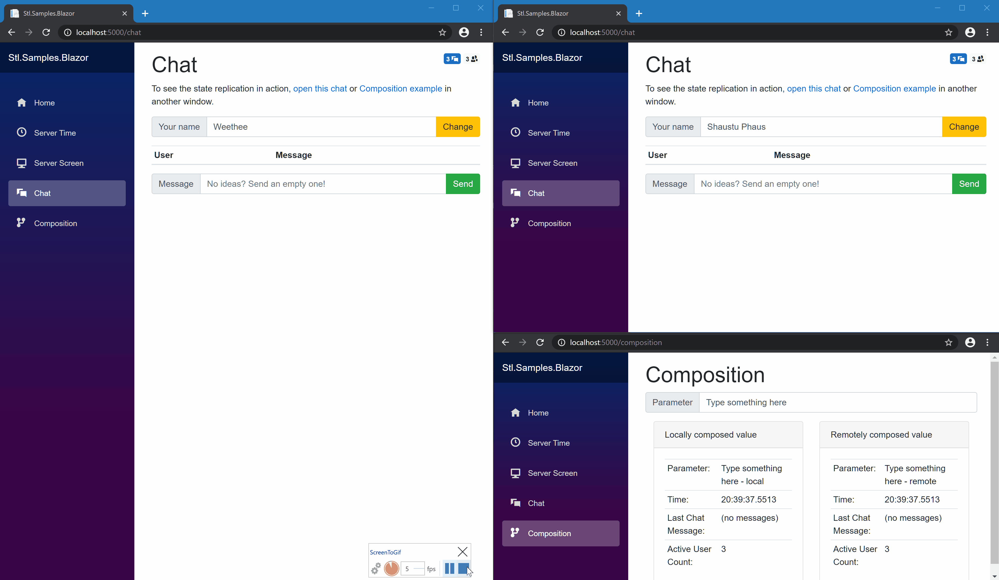

Welcome to the collection of [Fusion] samples!

> All project updates are published on its [Fusion Place]; it's also the best place for Q/A.\
> [](https://github.com/ActualLab/Fusion.Samples/actions?query=workflow%3A%22Build%22)
> [](https://voxt.ai/chat/s-1KCdcYy9z2-uJVPKZsbEo)  

Don't know what Fusion is? [You should!](https://github.com/ActualLab/Fusion) 
Fusion is your #1 partner in crime if you're 
building a real-time app (an online app delivering
some or all updates in real-time) or a high-load app.
Moreover, it plays really well with Blazor and works on MAUI.

> Curious to see Fusion in action? Explore [Voxt] –
> a very new chat app built by the minds behind Fusion.
>
> Voxt fuses **real-time audio, live transcription, and AI assistance**
> to let you communicate with utmost efficiency.
> With clients for **WebAssembly, iOS, Android, and Windows**, it boasts nearly
> 100% code sharing across these platforms.
> Beyond real-time updates, several of its features, like offline mode,
> are powered by Fusion.
>
> We're posting some code examples from Voxt codebase [here](https://voxt.ai/chat/san4Cohzym),
> so join this chat to learn how we use it in a real app.

Fusion allows you to build real-time UIs like this one —
and **it's nearly as easy as if there were no logic related to real-time
updates at all**:


 Play with 
[live version of this sample](https://fusion-samples.servicetitan.com) right now!

## Running Samples

Build & run locally with [.NET 10 SDK](https://dotnet.microsoft.com/download):

```bash
# Run this command first
dotnet build
```

| Sample              | Command                                                                                                                   |
|---------------------|---------------------------------------------------------------------------------------------------------------------------|
| [HelloCart]         | `dotnet run -p src/HelloCart/HelloCart.csproj`                                                                            |
| [HelloWorld]        | `dotnet run -p src/HelloWorld/HelloWorld.csproj`                                                                          |
| [HelloBlazorServer] | `dotnet run -p src/HelloBlazorServer/HelloBlazorServer.csproj` + open http://localhost:5005/                              |
| [HelloBlazorHybrid] | `dotnet run -p src/HelloBlazorHybrid/Server/Server.csproj` + open http://localhost:5005/                                  |
| [Blazor Samples]    | `dotnet run -p src/Blazor/Server/Server.csproj` + open http://localhost:5005/                                             |
| [TodoApp Sample]    | `dotnet run -p src/TodoApp/Host/Host.csproj` + open http://localhost:5005/                                                |
| [MiniRpc]           | `dotnet run -p src/MiniRpc/MiniRpc.csproj`                                                                                |
| [MultiServerRpc]    | `dotnet run -p src/MultiServerRpc/MultiServerRpc.csproj`                                                                  |
| [MeshRpc]           | `dotnet run -p src/MeshRpc/MeshRpc.csproj`                                                                                |
| [Benchmark]         | `dotnet run -c:Release -p src/Benchmark/Benchmark.csproj`                                                                 |
| [RpcBenchmark]      | `dotnet run -c:Release -p src/RpcBenchmark/RpcBenchmark.csproj`                                                           |

Build & run with [Docker](https://docs.docker.com/get-docker/) + 
[Docker Compose](https://docs.docker.com/compose/install/):

```bash
# Run this command first
docker-compose build
```

| Sample              | Command                                                                                               |
|---------------------|-------------------------------------------------------------------------------------------------------|
| [HelloCart]         | `docker-compose run --build sample_hello_cart`                                                        |
| [HelloWorld]        | `docker-compose run --build sample_hello_world`                                                       |
| [HelloBlazorServer] | `docker-compose run --build --service-ports sample_hello_blazor_server` + open http://localhost:5005/ |
| [HelloBlazorHybrid] | `docker-compose run --build --service-ports sample_hello_blazor_hybrid` + open http://localhost:5005/ |
| [Blazor Samples]    | `docker-compose run --build --service-ports sample_blazor` + open http://localhost:5005/              |
| [TodoApp Sample]    | `docker-compose run --build --service-ports sample_todoapp` + open http://localhost:5005/             |
| [MiniRpc]           | `docker-compose run --build sample_mini_rpc`                                                          |
| [MultiServerRpc]    | `docker-compose run --build sample_multi_server_rpc`                                                  |
| [MeshRpc]           | `docker-compose run --build sample_mesh_rpc`                                                          |
| [Benchmark]         | `docker-compose run --build sample_benchmark`                                                         |
| [RpcBenchmark]      | `docker-compose run --build sample_rpc_benchmark`                                                     |

A detailed description of nearly every sample can be found here: https://servicetitan.github.io/ActualLab.Fusion.Samples/

## Useful Links

* Check out [Fusion repository on GitHub]
* Join [Fusion Place] to ask questions and track project updates.
* Go to [Documentation].

**P.S.** If you've already spent some time learning about Fusion, 
please help us to make it better by completing [Fusion Feedback Form] 
(1&hellip;3 min).


[Fusion]: https://github.com/ActualLab/Fusion
[Fusion repository on GitHub]: https://github.com/ActualLab/Fusion

[HelloCart]: src/HelloCart
[HelloWorld]: src/HelloWorld
[HelloBlazorServer]: src/HelloBlazorServer
[HelloBlazorHybrid]: src/HelloBlazorHybrid
[Blazor Samples]: src/Blazor
[TodoApp Sample]: src/TodoApp
[MiniRpc]: src/MiniRpc
[MultiServerRpc]: src/MultiServerRpc
[MeshRpc]: src/MeshRpc
[Benchmark]: src/Benchmark
[RpcBenchmark]: src/RpcBenchmark
[Documentation]: https://fusion.actuallab.net/
[Voxt]: https://voxt.ai

[Compute Services]: https://fusion.actuallab.net/Part01
[Compute Service]: https://fusion.actuallab.net/Part01
[`IComputed<T>`]: https://fusion.actuallab.net/Part01
[Computed Value]: https://fusion.actuallab.net/Part01
[Compute Service Clients]: https://fusion.actuallab.net/Part03

[Fusion Place]: https://voxt.ai/chat/s-1KCdcYy9z2-uJVPKZsbEo
[Fusion Feedback Form]: https://forms.gle/TpGkmTZttukhDMRB6
