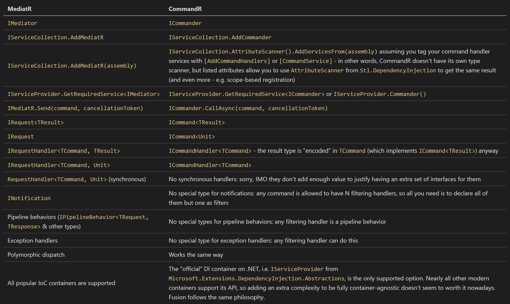

# Part 9: CommandR

[Stl.CommandR](https://www.nuget.org/packages/Stl.CommandR/)
is [MediatR](hhttps://github.com/jbogard/MediatR)-like library helping
to implement CQRS-style command handlers.
Together with a set of other abstractions it enables you to
get the pipeline described in the previous section with
almost no extra code.

> This part of the tutorial will cover CommandR itself. The next one
> will show how to use it together with other Fusion services
> to implement a robust CQRS pipeline.

Even though CommandR solves the same problem as MediatR, it offers
a few new features:

- Unified handler pipeline. Any CommandR handler
  can act either as a filter (~ middleware-like handler)
  or as the final one. MediatR supports pipeline behaviors, which
  are similar to filtering handlers in CommandR, but
  they are the same for all commands.
  And this feature is actually quite useful - e.g.
  built-in filter for `IPreparedCommand` helps to unify validation.
- `CommandContext` - an `HttpContext`-like type helping to
  non-handler code to store and access the state associated with
  the currently running command. Even though command contexts can
  be nested (commands may invoke other commands), the whole
  hierarchy of them is always available.
- Convention-based command handler discovery and invocation.
  You don't have to implement `ICommandHandler<TCommand, TResult>`
  every time you  want to add a handler - any async method tagged
  with `[CommandHandler]`
  and having command as its first parameter, and `CancellationToken` as the
  last one works; all other arguments are resolved via IoC container.
- AOP-style command handlers.
  Such handlers are virtual async methods with two arguments:
  `(command, cancellationToken)`. To make AOP part work,
  the type declaring such handlers must be registered with
  `AddCommandService(...)` -
  an extension method to `IServiceCollection` that registers
  a runtime-generated proxy instead of the actual implementation type.
  The proxy ensures any call to such method is *still* routed via
  `Commander.CallAsync(command)` to invoke the whole pipeline
  for this command - i.e. all other handlers associated
  with it.
  In other words, such handlers can be invoked directly or via
  `Commander`, but the result is always the same.

Since many of you are familiar with MediatR, here is the map
of its terms to CommandR terms:



You might notice the API offered by CommandR is somewhat simpler -
at least while you don't use some of its unique features mentioned
earlier.

## Hello, CommandR!

Let's declare our first command and its MediatR-style handler:

``` cs --region Part09_PrintCommandSession --source-file Part09.cs --session "Hello, CommandR!"
public class PrintCommand : ICommand<Unit>
{
    public string Message { get; set; } = "";
}

// Let's start with a classic handler
public class PrintCommandHandler : ICommandHandler<PrintCommand, Unit>
{
    public PrintCommandHandler()
    {
        WriteLine("Creating PrintCommandHandler.");
    }

    public async Task<Unit> OnCommandAsync(PrintCommand command, CommandContext<Unit> context, CancellationToken cancellationToken)
    {
        WriteLine(command.Message);
        WriteLine("Sir, yes, sir!");
        return default;
    }
}
```

Using CommandR and MediatR is quite similar:

``` cs --region Part09_PrintCommandSession2 --source-file Part09.cs --session "Hello, CommandR!"
// Building IoC container
var serviceBuilder = new ServiceCollection()
    .AddScoped<PrintCommandHandler>(); // Try changing this to AddSingleton
var commanderBuilder = serviceBuilder.AddCommander()
    .AddHandlers<PrintCommandHandler>();
var services = serviceBuilder.BuildServiceProvider();

var commander = services.Commander(); // Same as .GetRequiredService<ICommander>()
await commander.CallAsync(new PrintCommand() { Message = "Are you operational?" });
await commander.CallAsync(new PrintCommand() { Message = "Are you operational?" });
```

Notice that:

- CommandR doesn't auto-register command handler services - it
  cares only about figuring out how to map commands to
  command handlers available in these services.
  That's why you have to register services separately.
- `CallAsync` creates its own `IServiceScope` to resolve
  services for every command invocation. In reality, it does
  this only for top-level calls and calls switching between
  `ICommander` instances.
  Commands invoking other commands in the same `ICommander`
  instance share the same service scope.
- Try cha

**TBD:** Examples and the rest of this part.

#### [Next: Epilogue &raquo;](./PartFF.md) | [Tutorial Home](./README.md)

